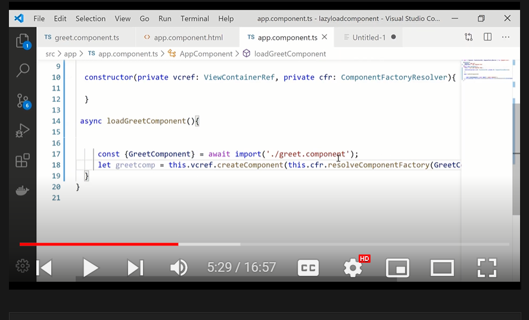

# Q5 Lazy Loading

```Ng g c greet --flat --skip-import ----------angular would not import the component```

We have to use two classes
ViecontainerRef
Componentfactoryresolver

Now use import component in the function
