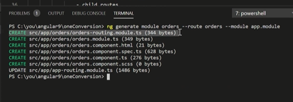

# Q5 Lazy Loading

```Ng g c greet --flat --skip-import ----------angular would not import the component```

Every lage application is made up of modules
1. users
   view users
   update-users
2. orders
3. cart

likee whenever angular starts , all the modules are needed irrespective of we need it or not,due to which bundle size increases drastically

Lazy loading means load modules whenever they are required 

Lazy loading is a type of design patterns where the modules are loaded when requested

Before Angular *
--loadChildren :{customerModule#module}

Dynamic function which will import

### how to use Lazy loading in our appl

This is a two step process
1. Create a feature module
  --- it own child routes

2. loadChildren 
 -config in app loading 


 ### How to implement lazy loading in aur application

 ```
 ng g module orders --route orders --module app.module
 ```
  


**In orders-routing.module.ts**
is the most important file

In app.routing.module.ts file , this is the most important file


loadChildren()=>import('/orders/orders.module.ts).then(m=>m.OrdersModule)

It will generate lazy loading feature module
  -orders

